### Blueprint Data Types

<sub>[previous](../setting-up/README.md#user-content-setting-up-unreal) • [home](../README.md#user-content-ue5-bp-overview) • [next](../fractions/README.md#user-content-fractional-numbers)</sub>


Unreal Blueprints is a visual scripting system in the Unreal Engine, a popular game development platform. It allows you to create gameplay mechanics, interactions, and logic using a node-based interface, without having to write traditional code. They all have a **C++** parent origin in the engine.

Imagine Blueprints as a graph where you connect different nodes together to create functionality in your game. Each node represents a specific action or condition, and you connect them by drawing lines between them. By combining these blocks, you can create complex behaviors and interactions for your game characters, objects, and environments.

The connections between nodes represent the flow of execution, determining the order in which actions are performed. When the game runs, the nodes are executed in sequence, and the actions they represent are carried out. This allows you to create interactive and dynamic gameplay experiences without writing code from scratch. The white triangles at the begining and end of a node are the execution nodes. They also have colored pins which is for the flow of data.

Blueprints is designed to be accessible to both programmers and non-programmers, allowing artists, designers, and other game developers to create gameplay systems without needing extensive coding knowledge. It provides a visual and intuitive way to prototype, iterate, and implement game mechanics.

C++ using **Unreal's Library** can compile and be used a blueprints. The relationship between Blueprints and C++ in Unreal Engine is complementary. Blueprints provide a visual and higher-level approach to implementing gameplay mechanics and interactions, while C++ offers greater control, flexibility, and performance optimizations. You can use both in combination, depending on your needs and the complexity of your project. Blueprint scripts can be extended and enhanced with custom C++ code when necessary to achieve specific functionality or improve performance.

Lets look at the complementary data types in UE5.
<br>

---

##### `Step 1.`\|`BPOVR`|:small_blue_diamond:

Let's add a **Blueprint** to the game that will hold some text.  Select the **Blueprints** folder and *right click* in the open area and select **Blueprint Class**. Then with the next popup, select **Actor** (we will be getting into classes later).  This is the minimum class needed to be a game object in the world.  This comes with lots of functionality that we will explore as we go along.  The most important thing is that it allows us to attach geometry, text and apply physics to that object.

>An Actor is any object that can be placed into a level, such as a Camera, static mesh, or player start location. Actors support 3D transformations such as translation, rotation, and scaling. - Unreal Manual

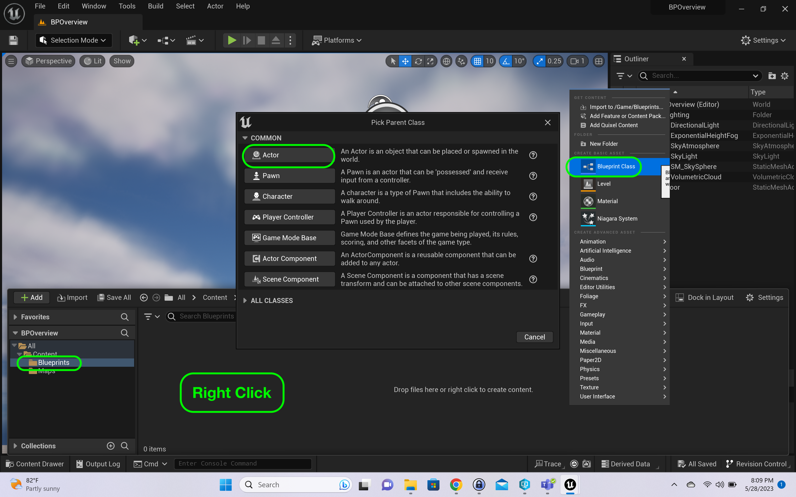


##### `Step 2.`\|`BPOVR`|:small_blue_diamond: :small_blue_diamond: 

Name that Blueprint `BP_Int`.  We are using [Unreal's Recommended Naming Convention](https://docs.unrealengine.com/4.27/en-US/ProductionPipelines/AssetNaming/) for our projects.  They recommends that we preface blueprint names with `BP_`.

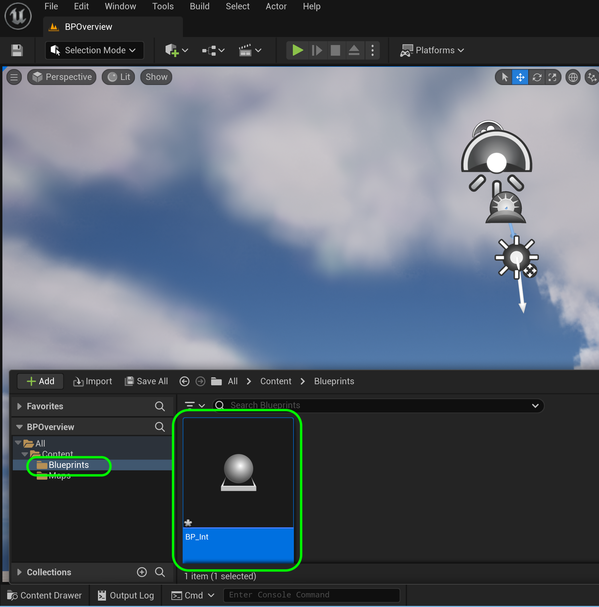


##### `Step 3.`\|`BPOVR`|:small_blue_diamond: :small_blue_diamond: :small_blue_diamond:

Open up **BP_Int**.  Press the <kbd>Add</kbd> button and add a **Text Render** component.

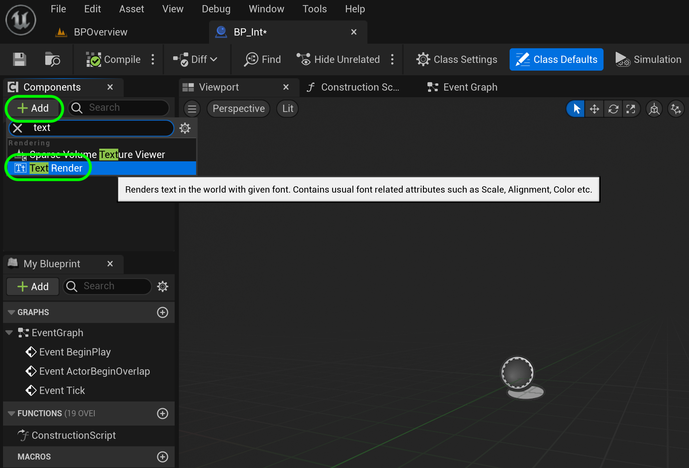


##### `Step 4.`\|`BPOVR`|:small_blue_diamond: :small_blue_diamond: :small_blue_diamond: :small_blue_diamond:

Rename **Text Render** to `IntegerText` and change the **Text** to `Integer`.  Set the **Horizontal Alignment** to `Center` and the **Vertical Aligmnet** to `Text Center`.  Pick a **Text Render Color** that contrasts with the blue sky.

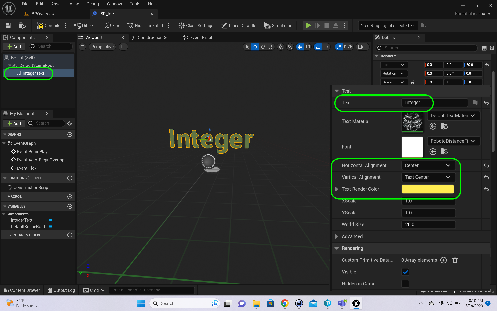


##### `Step 5.`\|`BPOVR`| :small_orange_diamond:

Drag a reference of **Integer Text** to the graph.  Pull off the pin and select **Text Render | Set Text**.

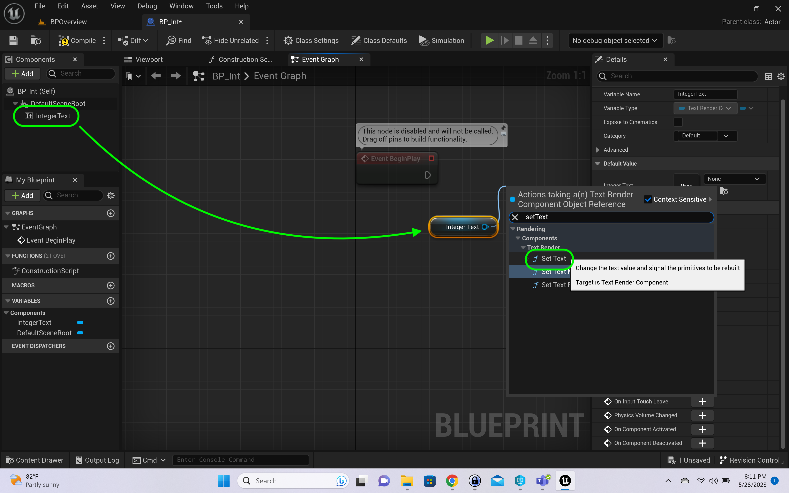


##### `Step 6.`\|`BPOVR`| :small_orange_diamond: :small_blue_diamond:

The **Begin Play** node is a special type of event node that is executed when an actor or object is first spawned or begins its gameplay in the level.

The Begin Play node is commonly used to set up initial conditions, initialize variables, and perform any necessary setup tasks when an actor or object is created. It serves as the entry point for executing logic and behavior at the start of gameplay.

Connect the execution pin from the **Begin Play** node to the **Set Text Node**. The **execution pin** refers to the pin on a node in the Blueprint visual scripting system that represents the flow of execution. It is typically denoted by a solid arrow or line extending from the node. The execution pin determines the order in which nodes are executed, controlling the flow of logic within the Blueprint.

When you connect nodes in a Blueprint graph using execution pins, you create a sequence of events that occur one after another. The execution starts from a specific entry point, such as the Event BeginPlay node, and then follows the connected execution pins to execute subsequent nodes.

Make sure **Integer Text** data pin is connected to **Set Text | Target**.


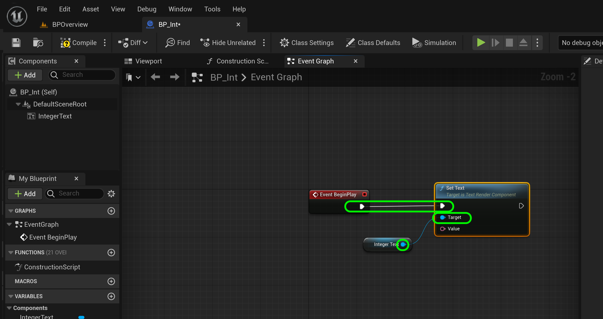


##### `Step 7.`\|`BPOVR`| :small_orange_diamond: :small_blue_diamond: :small_blue_diamond:

Press the **+** icon to add a **Variable**.  Selet `Integer`.  Now this is an Unreal `int32` in the C++ and not the vanilla C++ int, and is guaranteed to be 32 bit (4 bytes) on all systems. It is a Whole number value between −2,147,483,648 and 2,147,483,647.

Call the variable `Year`.

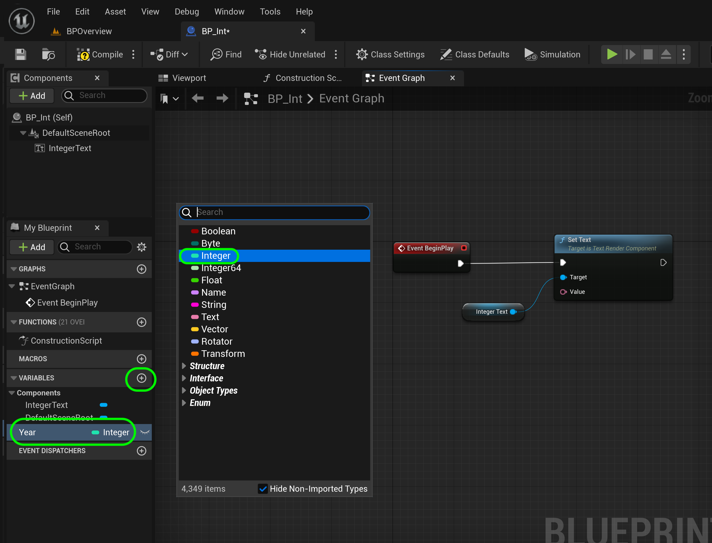


##### `Step 8.`\|`BPOVR`| :small_orange_diamond: :small_blue_diamond: :small_blue_diamond: :small_blue_diamond:

Drag a **Get IntegerText** to the graph.  Connect the **Year** integer output pin to the **Set Text | Value** node.  It will add a **To Text(Integer)** node to cast the int to a text format. Press the <kbd>Compile</kbd> button.


##### `Step 9.`\|`BPOVR`| :small_orange_diamond: :small_blue_diamond: :small_blue_diamond: :small_blue_diamond: :small_blue_diamond:

Now as soon as any variable is compiled in a blueprint it is initialized to the default value (`0` for int). So in a **Blueprint** you cannot declare without initializing a variable.  Set **Year** initilizing **Default Value** to `2050`.

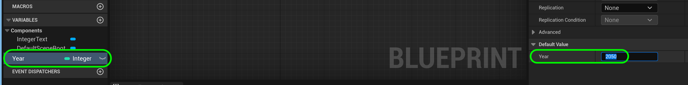


##### `Step 10.`\|`BPOVR`| :large_blue_diamond:

Drag **BP_Int** to the level.  Rotate it (in my case -90° on the **Z** axis) so it points to the camera.


##### `Step 11.`\|`BPOVR`| :large_blue_diamond: :small_blue_diamond: 

I find the text a bit light and small.  Open up **BP_Int** and change the color to taste, and I adjusted the **World Size** to `72`.

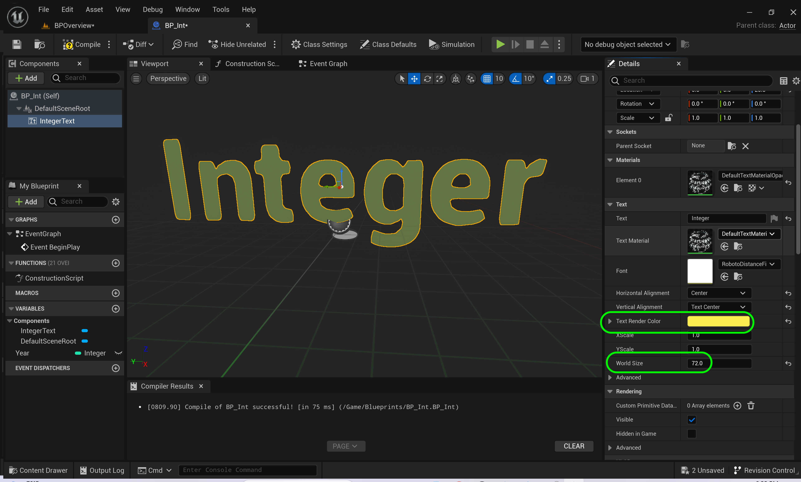


##### `Step 12.`\|`BPOVR`| :large_blue_diamond: :small_blue_diamond: :small_blue_diamond: 

Go back to the **Editor** and press the <kbd>Play</kbd> button.  Notice that Unreal by default formats the integer with a comma, which for a year is not good.  Lets fix that.

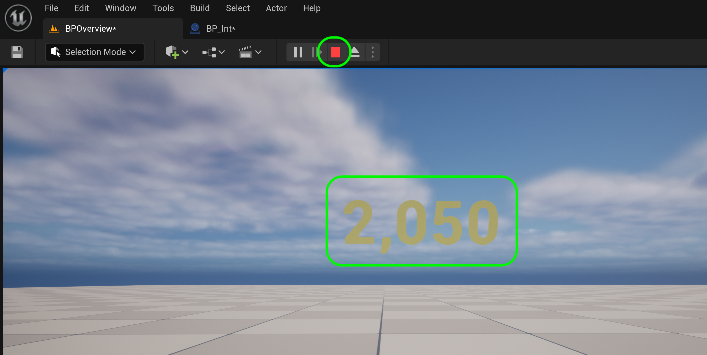


##### `Step 13.`\|`BPOVR`| :large_blue_diamond: :small_blue_diamond: :small_blue_diamond:  :small_blue_diamond: 

Go back to **BP_Int** and click on the arrow to see more settings in the **To Text** node and turn **Use Grouping** to `false`.

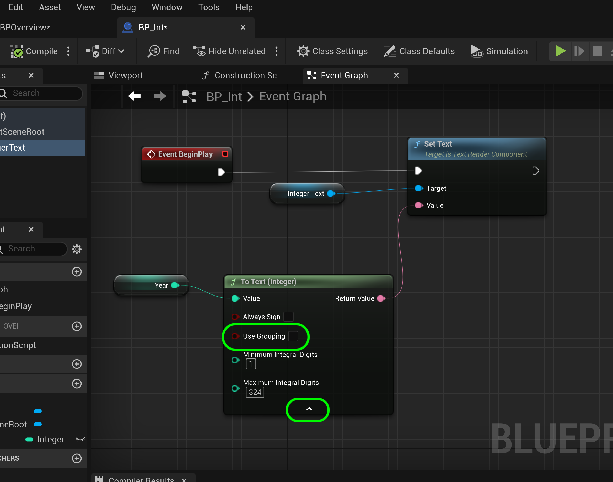


##### `Step 14.`\|`BPOVR`| :large_blue_diamond: :small_blue_diamond: :small_blue_diamond: :small_blue_diamond:  :small_blue_diamond: 

Press the <kbd>Play</kbd> button and now you ahve the year `2050` without the comma - formatted the way we like.


##### `Step 15.`\|`BPOVR`| :large_blue_diamond: :small_orange_diamond: 

Go back to **BP_Int** and add a **Format Text**.  Add the text

```
Integer
{A}
```
You get a newline in the **Format Text** node by pressing **Shift Enter**.  The `{A}` add another variable pin which will append the words **Integer** with the integer text. Now connect the **To Text | Return Value** to the **Format Text | A** pin then on to the **Value** pin in **Set Text**.

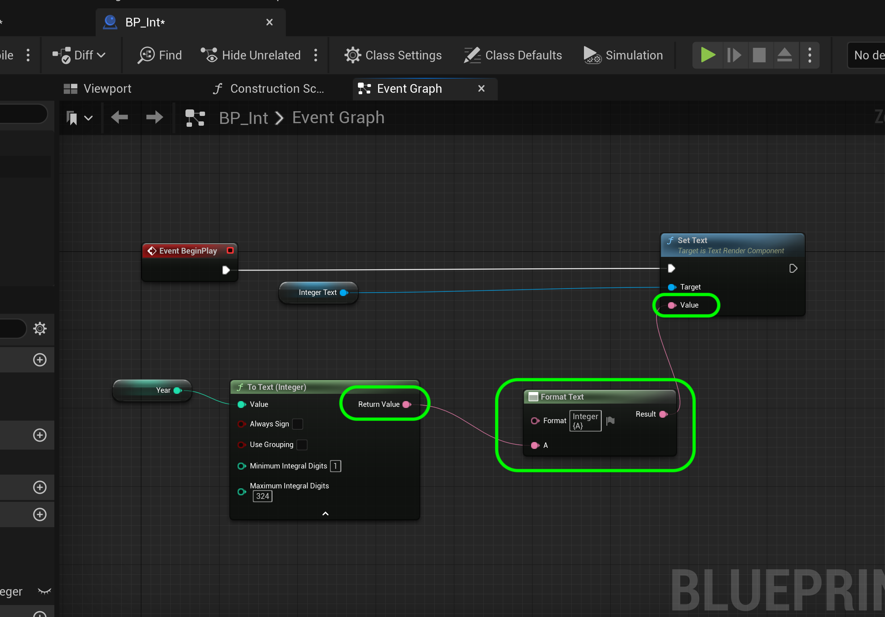


##### `Step 16.`\|`BPOVR`| :large_blue_diamond: :small_orange_diamond:   :small_blue_diamond: 

Press the <kbd>Play</kbd> button and you now have a title on top of the year.


##### `Step 17.`\|`BPOVR`| :large_blue_diamond: :small_orange_diamond: :small_blue_diamond: :small_blue_diamond:

Now you cannot do math within the **Literal** like you can in **C++**.  But you can add math nodes and add to the value.  I added 10 and it displays the result.

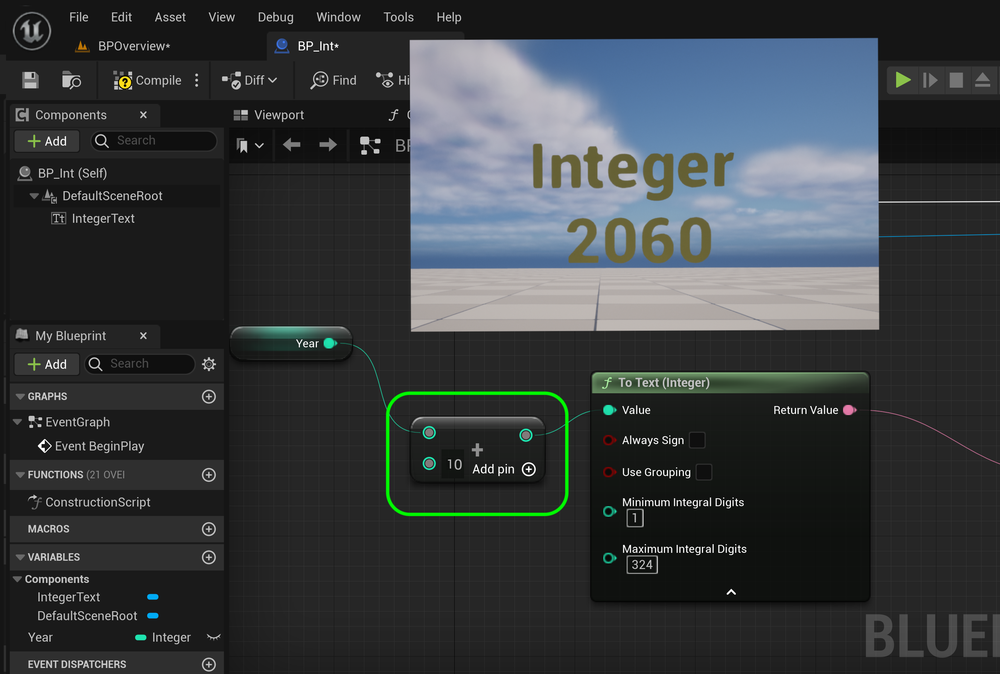


##### `Step 18.`\|`BPOVR`| :large_blue_diamond: :small_orange_diamond: :small_blue_diamond: :small_blue_diamond: :small_blue_diamond:

Unlike in **C++** if you try and add a double it will go back to an int when you press enter or leave the node.  So no conversion is happening after the compile and running of the game. Here I entered `8.5` and it changes automatically to `8` and removes the decimal and fraction.

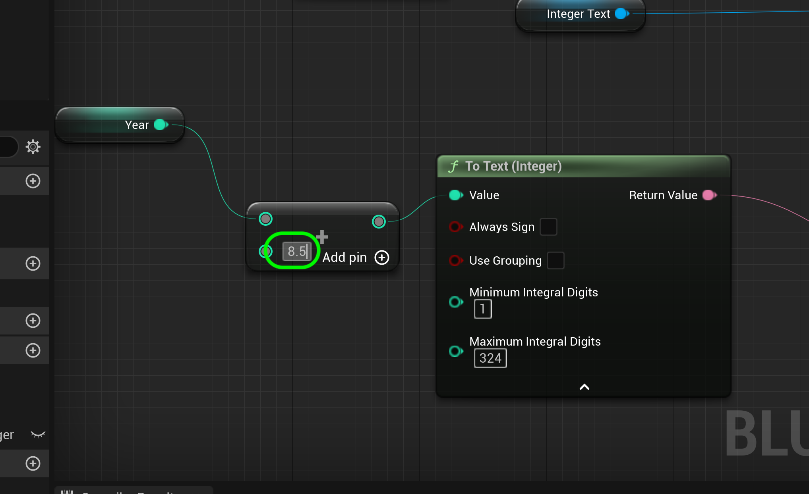


##### `Step 19.`\|`BPOVR`| :large_blue_diamond: :small_orange_diamond: :small_blue_diamond: :small_blue_diamond: :small_blue_diamond: :small_blue_diamond:

The other nice thing is that if we try and enter `2,147,483,648` (one over) - it doesn't wrap to `0` like in C++ but gets clamped at `2,147,483,647`.  Try it yourself...

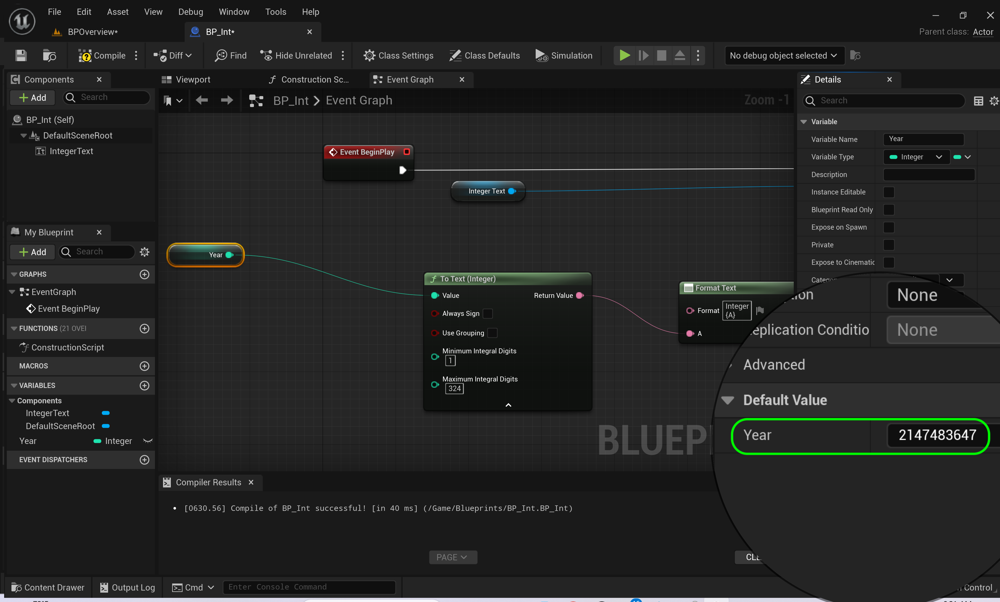


##### `Step 20.`\|`BPOVR`| :large_blue_diamond: :large_blue_diamond:

Now create a new varialbe called `Year64` and pick `Integer64`.  This is guaranteed to be `64` bits on all platforms. This is equivalent of a `long` in **C++**. It gives a range from −9,223,372,036,854,775,808 to 9,223,372,036,854,775,807. Add a new **To Text(Integer64)** node.  Drag a **Get Year64** to the graph.  Connect **Year64** to **To Text** and then to **Format Text**.  Put the largest number and print it to the screen.


##### `Step 21.`\|`BPOVR`| :large_blue_diamond: :large_blue_diamond: :small_blue_diamond:

Now alter the **Format Text** to:

```
Integer 64
{A}
Integer
{B}
```
Remember to get the newline you need to press <kbd>Shift</kbd> and <kbd>Return/Enter</kbd>. Now it will add an extra pin so put the **Integer** into **A** and **Integer64** into **B**.


<!--  -->


| [previous](../setting-up/README.md#user-content-setting-up-unreal)| [home](../README.md#user-content-ue5-bp-overview) | [next](../fractions/README.md#user-content-fractional-numbers)|
|---|---|---|
