### Fractional Numbers

<sub>[previous](../data-types/README.md#user-content-blueprint-data-types) • [home](../README.md#user-content-ue5-bp-overview) • [next](../text/README.md#user-content-fractional-names-strings-text)</sub>


The big change in **Unreal Engine 5** is the introduction of **double** precision floats in blueprints.  The documentation states that when a **float** is selected the bluerpint at compile time will determine if it is a single `float` or a `double`.

<br>

---

##### `Step 1.`\|`BPOVR`|:small_blue_diamond:

In the **Blueprints** folder add a new **Blueprint Class** of type **Actor** and call it `BP_Frac`.


##### `Step 2.`\|`BPOVR`|:small_blue_diamond: :small_blue_diamond: 

Open up **BP_Frac** and press the <kbd>Add</kbd> component button add a **TextRender** component.  Rename it to `Fractional Text`.

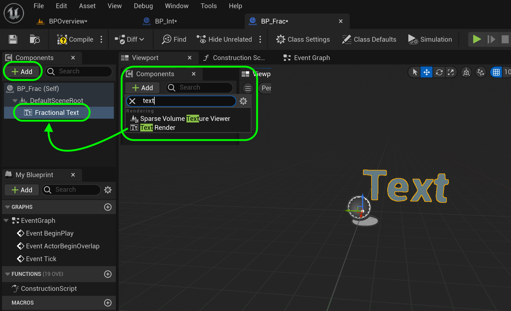


##### `Step 3.`\|`BPOVR`|:small_blue_diamond: :small_blue_diamond: :small_blue_diamond:

Copy and paste the color of the text from **BP_Int** to **BP_Frac** so you have the exact text color (you can <kbd>cntl-c</kbd> (copy) and <kbd>cont-v</kbd> (paste) any literal in a blueprint). Change the **World Size** to `72` and ceter both the **Horizontal Alignment** and **Vertical Alignment**.  Change the **Text** to `Double & Float`.

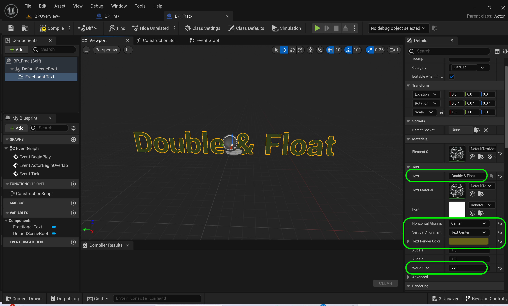


##### `Step 4.`\|`BPOVR`|:small_blue_diamond: :small_blue_diamond: :small_blue_diamond: :small_blue_diamond:

Drag the **FractionalText** to the graph.  Pull off the pin of the **Fractional Text** and select the **Set Text** node.

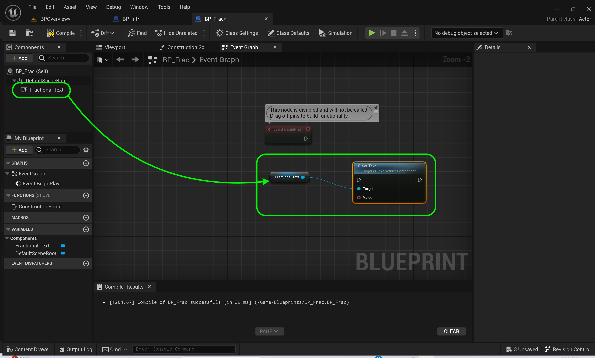


##### `Step 5.`\|`BPOVR`| :small_orange_diamond:

Connect the **Execution Pin** between **Begin Play** and **Set Text** nodes. The white arrows represents the order of operations.  It is like line number in C++.

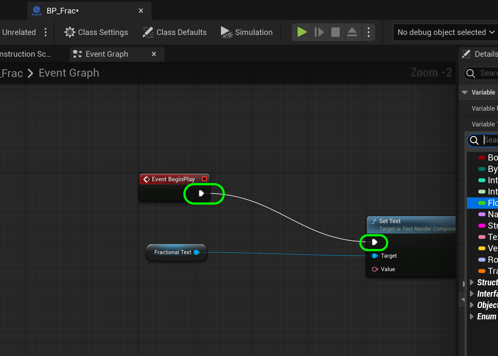


##### `Step 6.`\|`BPOVR`| :small_orange_diamond: :small_blue_diamond:

Create a new **Float** variable and call it `DoubleVar`.  In **Unreal 5** the float defaults to **double**.  The documentation says it decides at compile time to be a float or a double.  Drag **DoubleVar** onto the graph then put the curson on top of the output pin.  You will see type **double** in the tooltip.  Drag off of **DoubleVar** and select **To Text(Float)**. Press the <kbd>Compile</kbd> button and set the default float.  In this version I can only enter a *float* amount of digits and not the full 17 digits of a double. I assume this will be addressed.

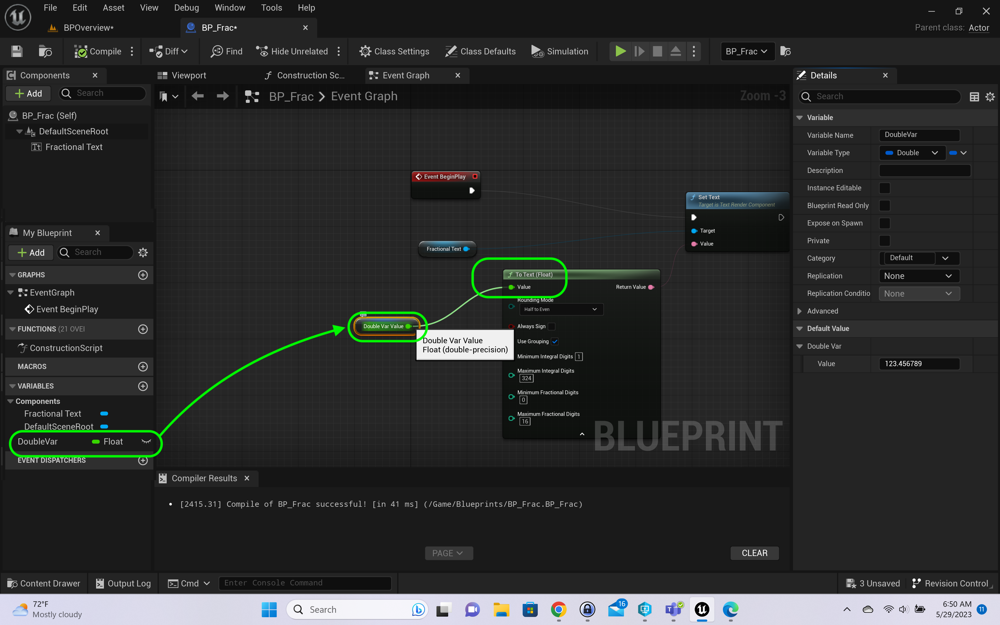


##### `Step 7.`\|`BPOVR`| :small_orange_diamond: :small_blue_diamond: :small_blue_diamond:

Connect the **To Text | Return Value** to the ***Set Text | Value**.

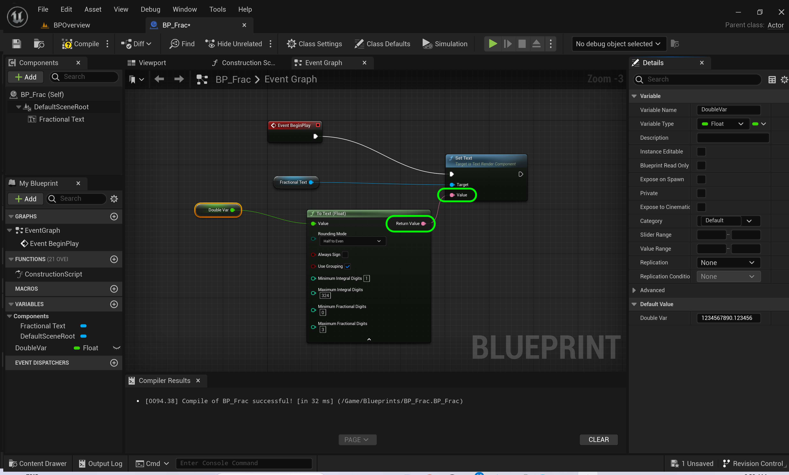


##### `Step 8.`\|`BPOVR`| :small_orange_diamond: :small_blue_diamond: :small_blue_diamond: :small_blue_diamond:

Go to the game and add **BP_Frac** to the room and place it on top of the **Int** leaving enough room between the classes.  Rotate the actor to face the camera.


##### `Step 9.`\|`BPOVR`| :small_orange_diamond: :small_blue_diamond: :small_blue_diamond: :small_blue_diamond: :small_blue_diamond:

Add a **Format Text** node between **Text Text** and **Set Text**.  Add the text:

```
Double or Float
{A}
```

Rember newline is achieved by a <kbd>Shift Return/Enter</kbd>.  The `{A}` add a pin to the format text and will append the float to this **Text**.

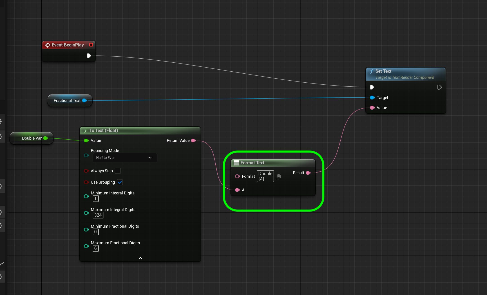


##### `Step 10.`\|`BPOVR`| :large_blue_diamond:

Press the <kbd>Compile</kbd> button and go back to the game. Press the <kbd>Start</kbd> button.  You should now see the 


##### `Step 11.`\|`BPOVR`| :large_blue_diamond: :small_blue_diamond: 

In the game you can navigate with the **WASD** keys to move along the ground and the **Q** (Up) and **E** (Down) keys to move up and down. Now the game starts where the camera last left off.  We can also set a starting point for the game.

Press the **Add Object** button (box with arrow) and type in **Player Start** and add the player start actor to the level in front of your text.


##### `Step 12.`\|`BPOVR`| :large_blue_diamond: :small_blue_diamond: :small_blue_diamond: 

Rotate the player start actor so it faces the text.  Look at the blue arrow to know the front facing direction of the player when starting.


##### `Step 13.`\|`BPOVR`| :large_blue_diamond: :small_blue_diamond: :small_blue_diamond:  :small_blue_diamond: 

Press the **Three Dots** next to the <kbd>Play</kbd> button.  Select **Default Player Start**. Press the <kbd>Play</kbd> button and adjust the position of the player start so you are well centered and happy with your starting position.  This way you can now move around and you will always start at the same place every time.


##### `Step 14.`\|`BPOVR`| :large_blue_diamond: :small_blue_diamond: :small_blue_diamond: :small_blue_diamond:  :small_blue_diamond: 

Go back to **BP_Frac** and *right click* and select **Keyboard Events | X** node. 


##### `Step 15.`\|`BPOVR`| :large_blue_diamond: :small_orange_diamond: 

Drag another copy of the **DoubleVar** variable to the graph.  Add a **Random Float in Range** node and set it from `2.0` to `5.0`.  Then add a **Multiplication node and multiply **DoubleVar** by the **Random Float in Range**.

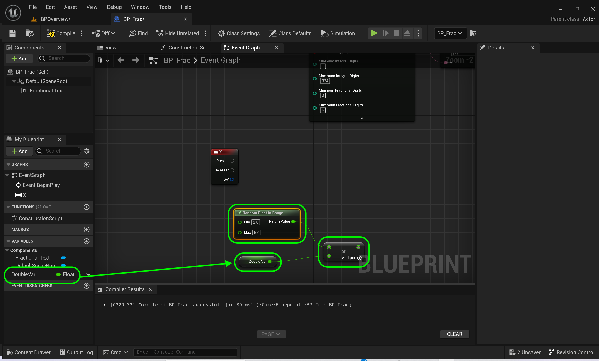


##### `Step 16.`\|`BPOVR`| :large_blue_diamond: :small_orange_diamond:   :small_blue_diamond: 

Drag yet another copy of **DoubleVar** onto the graph and this time select **Set DoubleVar** node.

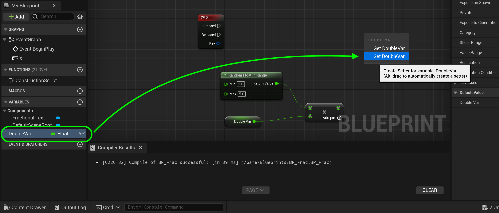


##### `Step 17.`\|`BPOVR`| :large_blue_diamond: :small_orange_diamond: :small_blue_diamond: :small_blue_diamond:

Connect the execution pin from the **X** node to the new **Set DoubleVar** node.  Connect the output of the **Multiply** node to the input pin of the **Set DoubleVar** node.  Add another copy of the **Factional Text** component to the graph. Pull off the pin and select a **Set Text** node.  Finally connect the execution pin from the output of the **DoubleVar** to the **SetText** node.

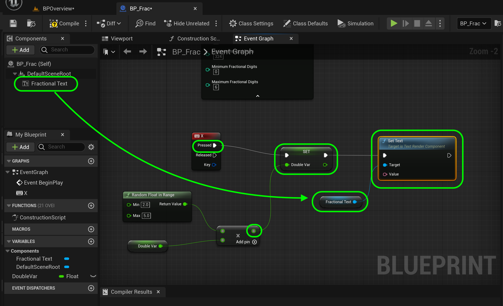


##### `Step 18.`\|`BPOVR`| :large_blue_diamond: :small_orange_diamond: :small_blue_diamond: :small_blue_diamond: :small_blue_diamond:

Select all the nodes coming from begin play with the mouse.  Press the <kbd>C</kbd> button and Unreal creates a group with a comment.  Call it `Set Initial Text`.  Now when ouou move it around, all the nodes move with it.  You can also customize the color of the node away from the default white.

Select all the nodes attached the **X** button pin and press the <kbd>C</kbd> button and call it `Miltiply Text on X Button Press`. Organize the nodes to be clean and organized.

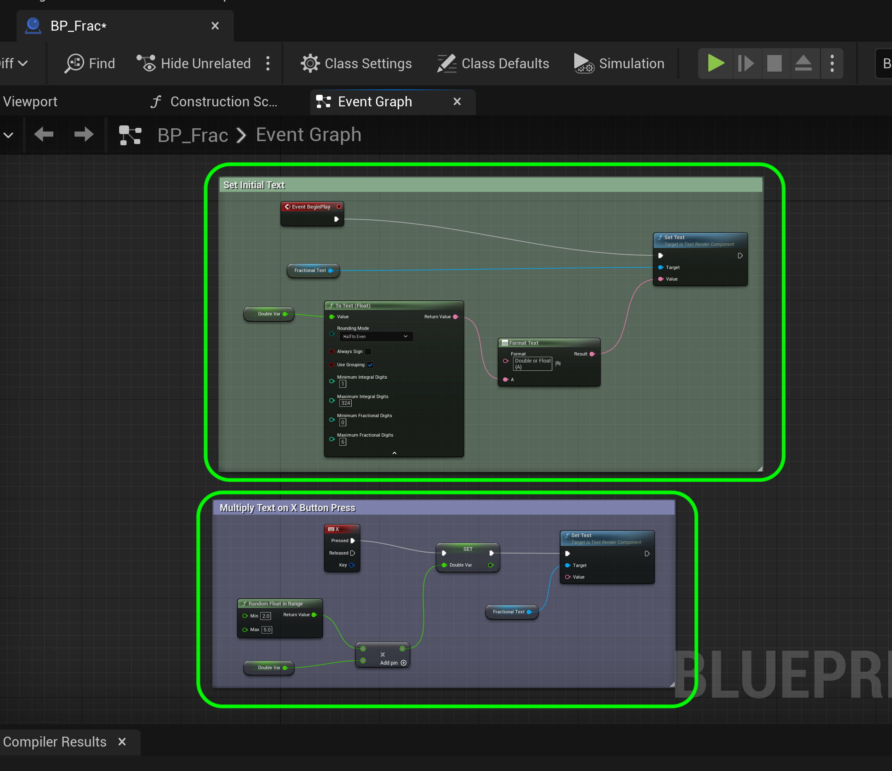


##### `Step 19.`\|`BPOVR`| :large_blue_diamond: :small_orange_diamond: :small_blue_diamond: :small_blue_diamond: :small_blue_diamond: :small_blue_diamond:

Press the **Compile** button and I get an error.  Nothing is connected to the **Set Text | Value** pin.

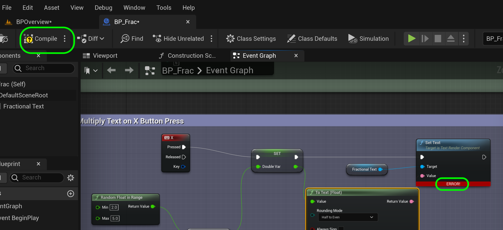


##### `Step 20.`\|`BPOVR`| :large_blue_diamond: :large_blue_diamond:

Connect the **To Text | Return Value** and connect it to **Set Text | Value**.  Press the <kbd>Compile</kbd> button and the error goes away. Also, lets set the **Maximum Fractional Digits** to `16` to see if we get double precision.

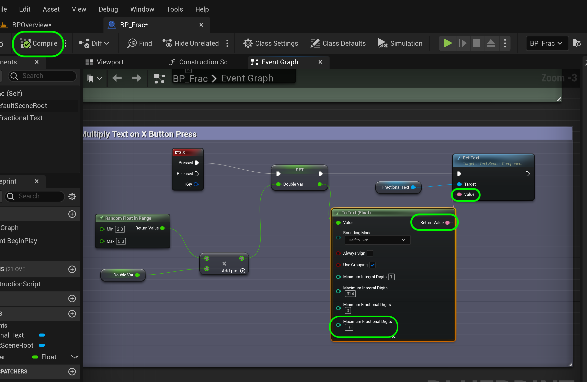


##### `Step 21.`\|`BPOVR`| :large_blue_diamond: :large_blue_diamond: :small_blue_diamond:

Now you will not be able to get the **X** event unless you allow the actor to receive input.  Select the **PB_Frac(Self)** top component and turn **Auto Receive Input** to `Player0`.

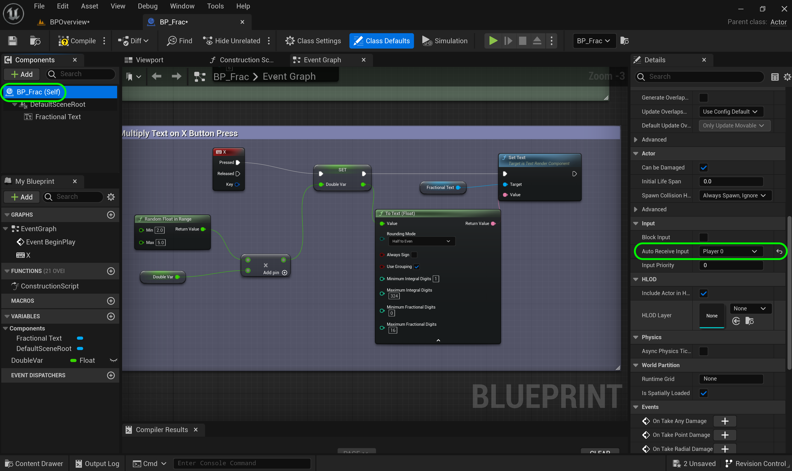


##### `Step 22.`\|`BPOVR`| :large_blue_diamond: :large_blue_diamond: :small_blue_diamond: :small_blue_diamond:

Add a **Format Text** node to match the title that is displayed before you press the **X**.

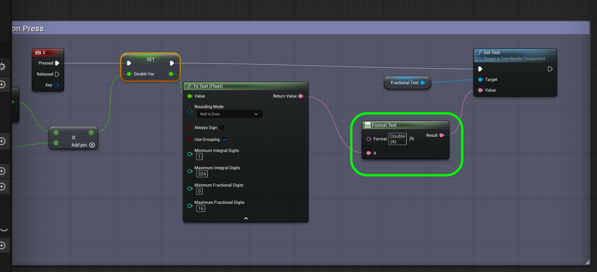


##### `Step 23.`\|`BPOVR`| :large_blue_diamond: :large_blue_diamond: :small_blue_diamond: :small_blue_diamond:

Change the default value of **DoubleVar** to a small number like `1.2` so we get a better idea of the precision.  Press the <kbd>Compile</kbd> button.Press the <kbd>Play</kbd> button and then press the <kbd>X</kbd> and you will see fractions with the precision of a double!


<!--  -->


| [previous](../data-types/README.md#user-content-blueprint-data-types)| [home](../README.md#user-content-ue5-bp-overview) | [next](../text/README.md#user-content-fractional-names-strings-text)|
|---|---|---|
