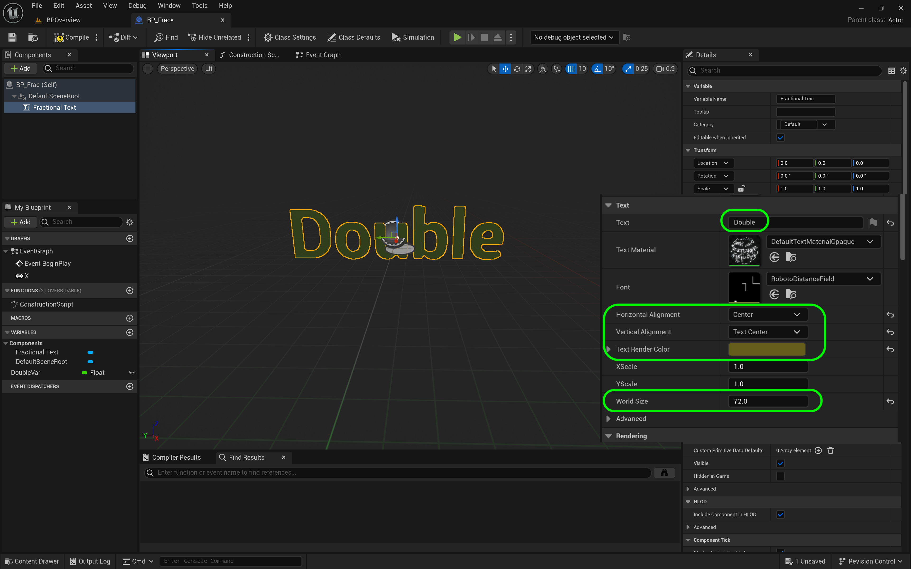

### Fractional Numbers

<sub>[previous](../data-types/README.md#user-content-blueprint-data-types) • [home](../README.md#user-content-ue5-bp-overview) • [next](../)</sub>


The big change in **Unreal Engine 5** is the introduction of **double** precision floats in blueprints.  The documentation states that when a **float** is selected the bluerpint at compile time will determine if it is a single `float` or a `double`.

<br>

---

##### `Step 1.`\|`BPOVR`|:small_blue_diamond:

In the **Blueprints** folder add a new **Blueprint Class** of type **Actor** and call it `BP_Frac`.


##### `Step 2.`\|`BPOVR`|:small_blue_diamond: :small_blue_diamond: 

Open up **BP_Frac** and press the <kbd>Add</kbd> component button add a **TextRender** component.  Rename it to `Fractional Text`.


##### `Step 3.`\|`BPOVR`|:small_blue_diamond: :small_blue_diamond: :small_blue_diamond:

Copy and paste the color of the text from **BP_Int** to **BP_Frac** so you have the exact text color (you can <kbd>cntl-c</kbd> (copy) and <kbd>cont-v</kbd> (paste) any literal in a blueprint). Change the **World Size** to `72` and ceter both the **Horizontal Alignment** and **Vertical Alignment**.  Change the **Text** to `Double & Float`.




##### `Step 4.`\|`BPOVR`|:small_blue_diamond: :small_blue_diamond: :small_blue_diamond: :small_blue_diamond:

Drag the **FractionalText** to the graph.  Pull off the pin of the **Fractional Text** and select the **Set Text** node.


##### `Step 5.`\|`BPOVR`| :small_orange_diamond:

Connect the **Execution Pin** between **Begin Play** and **Set Text** nodes. The white arrows represents the order of operations.  It is like line number in C++.


##### `Step 6.`\|`BPOVR`| :small_orange_diamond: :small_blue_diamond:

Create a new **Float** variable and call it `DoubleVar`.  In **Unreal 5** the float defaults to **double**.  The documentation says it decides at compile time to be a float or a double.  Drag **DoubleVar** onto the graph then put the curson on top of the output pin.  You will see type **double** in the tooltip.  Drag off of **DoubleVar** and select **To Text(Float)**. Press the <kbd>Compile</kbd> button and set the default float.  In this version I can only enter a *float* amount of digits and not the full 17 digits of a double. I assume this will be addressed.


##### `Step 7.`\|`BPOVR`| :small_orange_diamond: :small_blue_diamond: :small_blue_diamond:

Connect the **To Text | Return Value** to the ***Set Text | Value**.


##### `Step 8.`\|`BPOVR`| :small_orange_diamond: :small_blue_diamond: :small_blue_diamond: :small_blue_diamond:

Go to the game and add **BP_Frac** to the room and place it on top of the **Int** leaving enough room between the classes.  Rotate the actor to face the camera.


##### `Step 9.`\|`BPOVR`| :small_orange_diamond: :small_blue_diamond: :small_blue_diamond: :small_blue_diamond: :small_blue_diamond:

Add a **Format Text** node between **Text Text** and **Set Text**.  Add the text:

```
Double or Float
{A}
```

Rember newline is achieved by a <kbd>Shift Return/Enter</kbd>.  The `{A}` add a pin to the format text and will append the float to this **Text**.


##### `Step 10.`\|`BPOVR`| :large_blue_diamond:

Press the <kbd>Compile</kbd> button and go back to the game. Press the <kbd>Start</kbd> button.  You should now see the 


##### `Step 11.`\|`BPOVR`| :large_blue_diamond: :small_blue_diamond: 


##### `Step 12.`\|`BPOVR`| :large_blue_diamond: :small_blue_diamond: :small_blue_diamond: 


##### `Step 13.`\|`BPOVR`| :large_blue_diamond: :small_blue_diamond: :small_blue_diamond:  :small_blue_diamond: 


##### `Step 14.`\|`BPOVR`| :large_blue_diamond: :small_blue_diamond: :small_blue_diamond: :small_blue_diamond:  :small_blue_diamond: 


##### `Step 15.`\|`BPOVR`| :large_blue_diamond: :small_orange_diamond: 


##### `Step 16.`\|`BPOVR`| :large_blue_diamond: :small_orange_diamond:   :small_blue_diamond: 


##### `Step 17.`\|`BPOVR`| :large_blue_diamond: :small_orange_diamond: :small_blue_diamond: :small_blue_diamond:


##### `Step 18.`\|`BPOVR`| :large_blue_diamond: :small_orange_diamond: :small_blue_diamond: :small_blue_diamond: :small_blue_diamond:


##### `Step 19.`\|`BPOVR`| :large_blue_diamond: :small_orange_diamond: :small_blue_diamond: :small_blue_diamond: :small_blue_diamond: :small_blue_diamond:


##### `Step 20.`\|`BPOVR`| :large_blue_diamond: :large_blue_diamond:


##### `Step 21.`\|`BPOVR`| :large_blue_diamond: :large_blue_diamond: :small_blue_diamond:


<!--  -->


| [previous](../data-types/README.md#user-content-blueprint-data-types)| [home](../README.md#user-content-ue5-bp-overview) | [next](../)|
|---|---|---|
