### Blueprint Iteration II

[previous](../iteration/README.md#user-content-blueprint-iteration) • [home](../README.md#user-content-ue5-bp-overview) • [next](../)

Now loops are similar to switch statements and again, can contain lots of execution pins.  Keep your graph clean and organized.

 

---

##### `Step 1.`\|`BPOVR`|:small_blue_diamond:

Select the **Blueprints** folder and right click in the empty folder area to add a **Blueprint Class** of type **Actor** called `BP_Loops`.

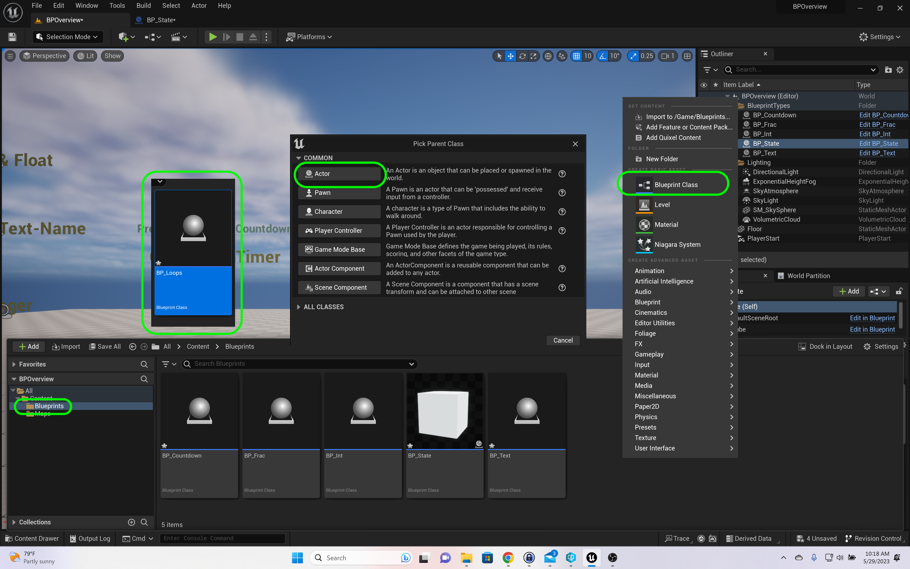

##### `Step 2.`\|`BPOVR`|:small_blue_diamond: :small_blue_diamond: 

Add two **Text Render** components renaming the first to `ForLoop` and second to `WhileLoop`.

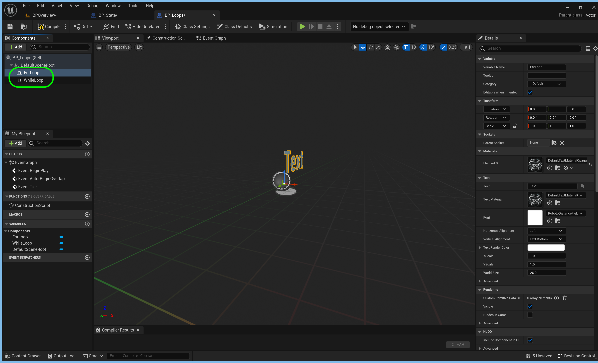

##### `Step 3.`\|`BPOVR`|:small_blue_diamond: :small_blue_diamond: :small_blue_diamond:

Select the **ForLoop** component and set the **Text** to `For Loop`, the **Horizontal Algnment** to `Center` and **Vertical Alignment** to `TextCenter`.  Change the **Text Render Color** to the color you have been using (cut and paste it) and the **World Size** to `72`.

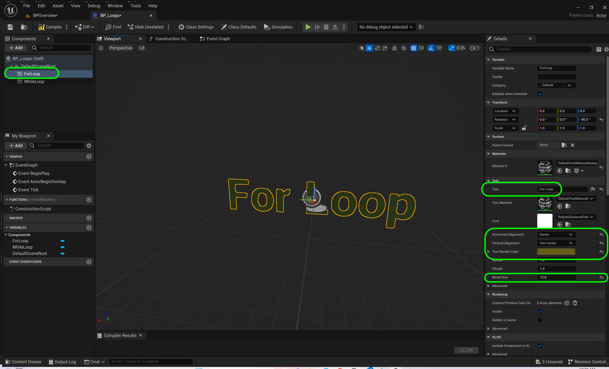

##### `Step 4.`\|`BPOVR`|:small_blue_diamond: :small_blue_diamond: :small_blue_diamond: :small_blue_diamond:

Repeat this for the **WhileLoop** component keeping everything the same as the above except make the **Text** say `While Loop`.

##### `Step 5.`\|`BPOVR`| :small_orange_diamond:

Create an **Integer** variable and call it `WhileInt`.  Make sure **Private** is set to `true`.  Lets start with a while loop.  *Right click* on the graph and select a **While Loop** node.

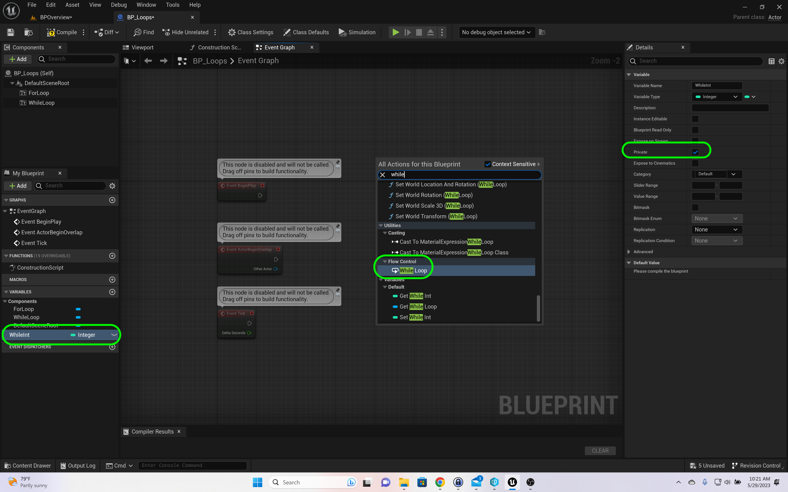

##### `Step 6.`\|`BPOVR`| :small_orange_diamond: :small_blue_diamond:

Notice the **While Loop** has a **Condition** pin.  This is similar to `while (WhileInt < 10) {}` in C++.  So we drag a **Get WhileInt**t o the graph and send it to a **Less Than (<)** node.

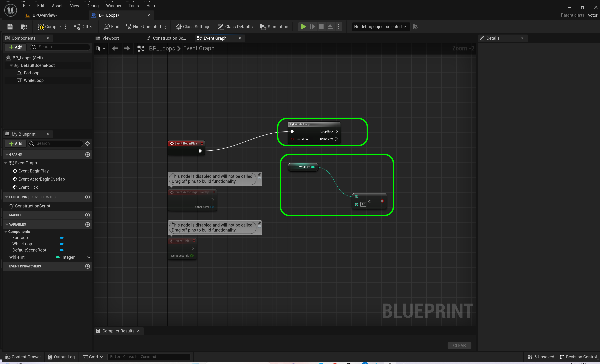

##### `Step 7.`\|`BPOVR`| :small_orange_diamond: :small_blue_diamond: :small_blue_diamond:

Connect the output of the **<** node to the **While Loop** condition bool.  Add another **Get WhileInt** node and select the data pin and choose a **++** increment node that will increment this variable by 1.  Connect it to the **Loop Body** pin.  This way when it reaches `10` it will fall out of the loop.  WIthout this, we would have an infinite loop.

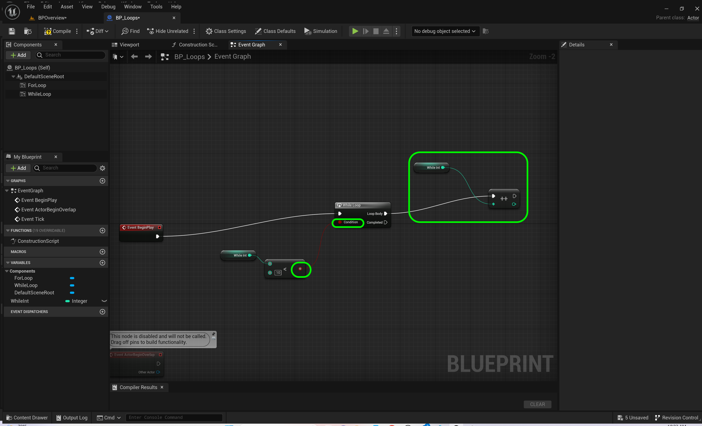

##### `Step 8.`\|`BPOVR`| :small_orange_diamond: :small_blue_diamond: :small_blue_diamond: :small_blue_diamond:

Select all the nodes and add a **Comment** box by pressing the <kbd>C</kbd> key.  Call this comment box `While Loop`.

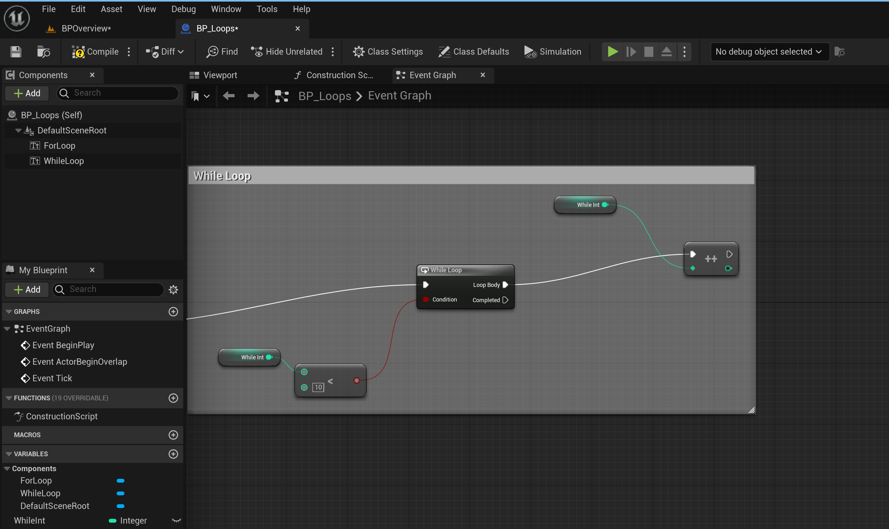

##### `Step 9.`\|`BPOVR`| :small_orange_diamond: :small_blue_diamond: :small_blue_diamond: :small_blue_diamond: :small_blue_diamond:

Create a variable to hold concatonated numbers.  Lets make is a **String** type and call it `While String` making it **Private**. Drag the **While String** to the graph and add an **Append** string node with the **While String** going into **A**, the **B** pin set to `, `.  Press the **Add Pin** and add the output of the **++** node to the **C** pin (it will add an int to string conversion node).

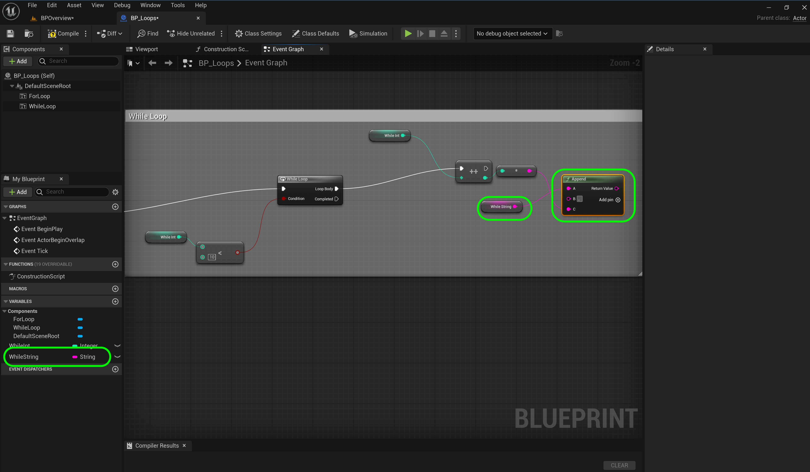

##### `Step 10.`\|`BPOVR`| :large_blue_diamond:

Finally add a **Set WhileString** node and put the output of the **Append** node to the **While String**.  Connect the execution pin of the **++** node to the **Set While** string.

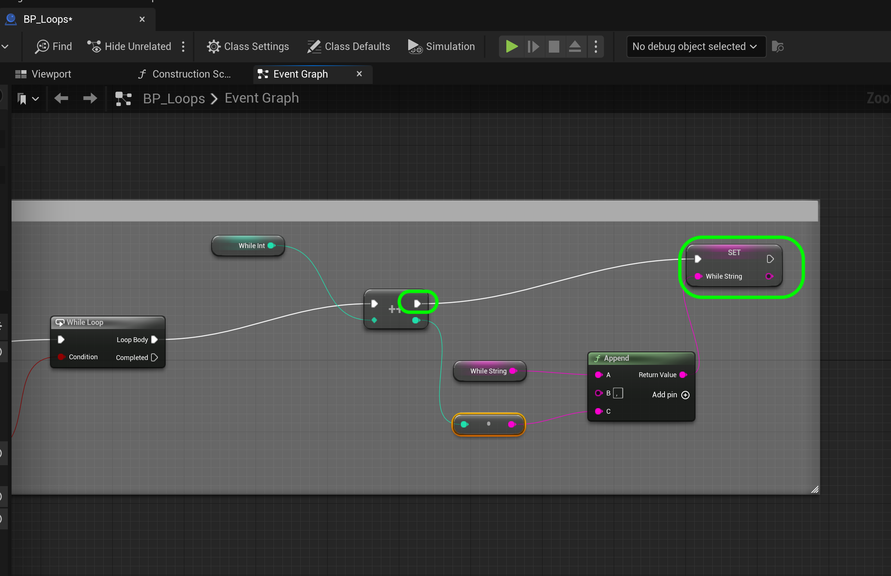

##### `Step 11.`\|`BPOVR`| :large_blue_diamond: :small_blue_diamond: 

Drag off of the **While Loop | Completed** execution pin and add a **While Loop** and **Set Text** nodes.  Drag a **Get WhileString** node and connect it to the **Set Text | Value** pin. The engine will convert from a **String** to a **Text**.

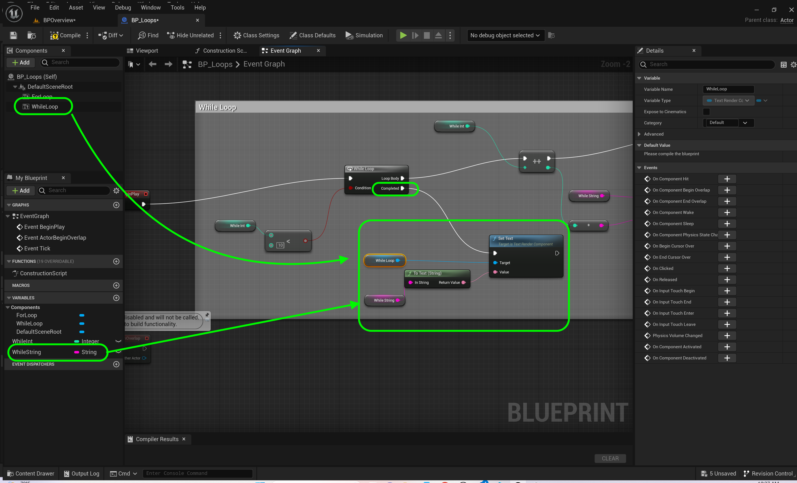

##### `Step 12.`\|`BPOVR`| :large_blue_diamond: :small_blue_diamond: :small_blue_diamond: 

Go to the game engine and add a **BP_Loop** to the level and place it.  Make sure it is in the **Blueprint Types** folder in the details panel.

##### `Step 13.`\|`BPOVR`| :large_blue_diamond: :small_blue_diamond: :small_blue_diamond:  :small_blue_diamond: 

Press the <kbd>Play</kbd> button and notice that we have an extra comma at the begining we don't want. Lets fix that.

##### `Step 14.`\|`BPOVR`| :large_blue_diamond: :small_blue_diamond: :small_blue_diamond: :small_blue_diamond:  :small_blue_diamond: 

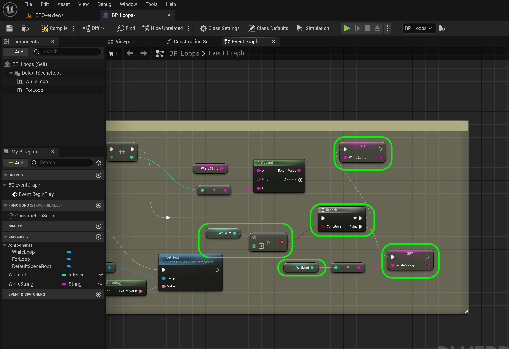

##### `Step 15.`\|`BPOVR`| :large_blue_diamond: :small_orange_diamond: 

##### `Step 16.`\|`BPOVR`| :large_blue_diamond: :small_orange_diamond:   :small_blue_diamond: 

##### `Step 17.`\|`BPOVR`| :large_blue_diamond: :small_orange_diamond: :small_blue_diamond: :small_blue_diamond:

##### `Step 18.`\|`BPOVR`| :large_blue_diamond: :small_orange_diamond: :small_blue_diamond: :small_blue_diamond: :small_blue_diamond:

##### `Step 19.`\|`BPOVR`| :large_blue_diamond: :small_orange_diamond: :small_blue_diamond: :small_blue_diamond: :small_blue_diamond: :small_blue_diamond:

##### `Step 20.`\|`BPOVR`| :large_blue_diamond: :large_blue_diamond:

##### `Step 21.`\|`BPOVR`| :large_blue_diamond: :large_blue_diamond: :small_blue_diamond:

<!--  -->

| [previous](../iteration/README.md#user-content-blueprint-iteration)| [home](../README.md#user-content-ue5-bp-overview) | [next](../)|
|---|---|---|
