### Blueprint Iteration

[previous](../operators-ii/README.md#user-content-blueprint-operators-ii) • [home](../README.md#user-content-ue5-bp-overview) • [next](../iteration-ii/README.md#user-content-blueprint-iteration-ii)

Lets add a stat to a game object and use a switch statement to change messages. Now iterating loops in Blueprints can be a bit unwieldly.  This is one area where I think **C++** is a bit easier to read and elegant than the amount of pins often needed in an iteration in a blueprint.

 

---

##### `Step 1.`\|`BPOVR`|:small_blue_diamond:

Select the **Blueprints** folder and right click in the open area and selet **Blueprint Class** and press the <kbd>Actor</kbd> button.  Name this new Blueprint `BP_State`.

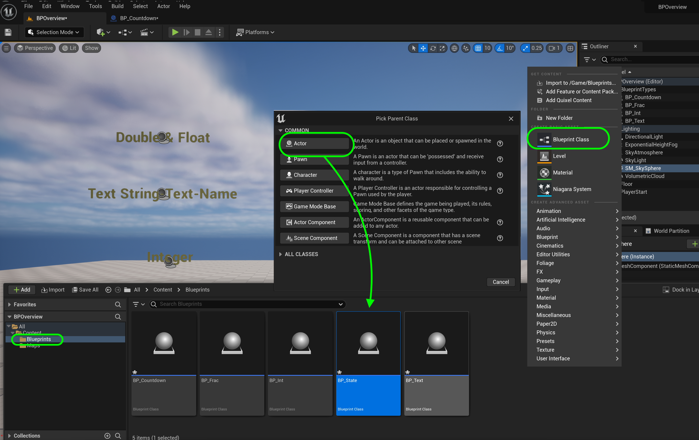

##### `Step 2.`\|`BPOVR`|:small_blue_diamond: :small_blue_diamond: 

For visual interest add a **Cube** component.  This will simulate an actor with a thought bubble above their head.  Add a **TextRender** component and call it `State Description`.  Change the **Text** to `I am `, the **Horizontal Alignment** and **Vertical Alignment** to `Center` and `TextCenter` and the **Text Render Color** to the same color we have been using.  Finally change the **World Size** to `72`.  Adjust the height of the text so it is above the cube.

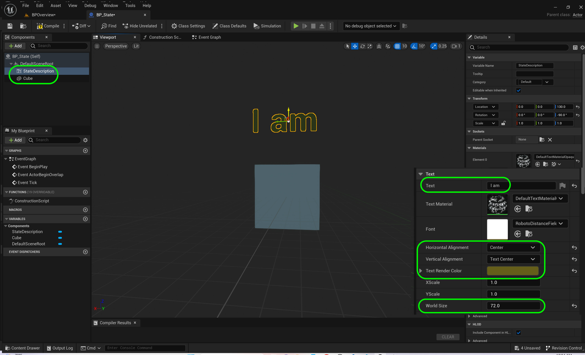

##### `Step 3.`\|`BPOVR`|:small_blue_diamond: :small_blue_diamond: :small_blue_diamond:

Create a new **Integer** variable called `State`. Now, I think it is important to mark variables as **Private** (can only be read by this blueprint - not any other including child blueprints).  Only leave it public, when you are certain that you need to access tis variable from outside this blueprint.  It is a good way to protect yourself for unpredictable behavior in the game.

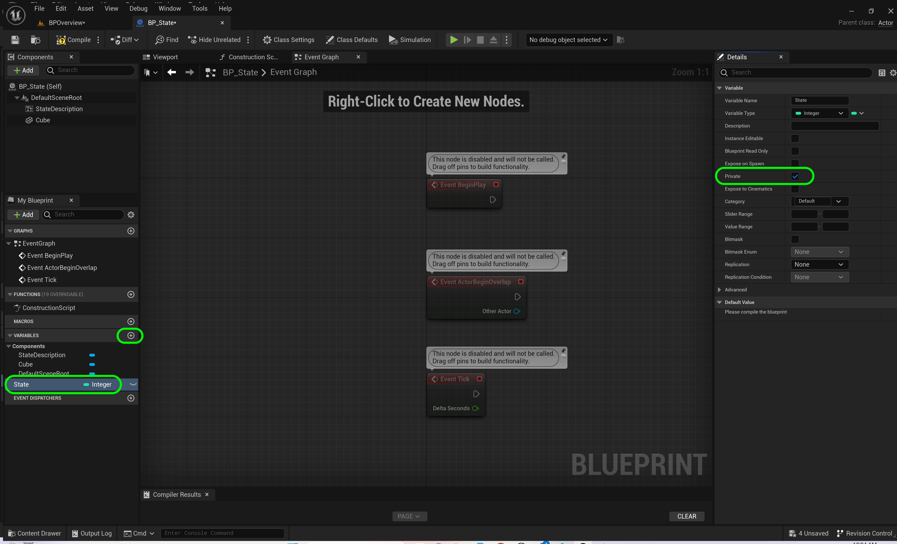

##### `Step 4.`\|`BPOVR`|:small_blue_diamond: :small_blue_diamond: :small_blue_diamond: :small_blue_diamond:

Drag the **State** variabel to the graph.  Click off the pin and select a **Switch on Int** node.

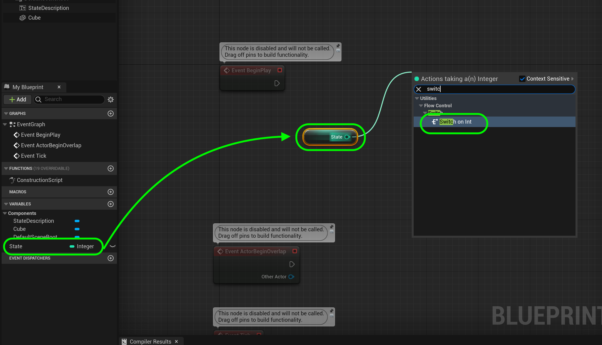

##### `Step 5.`\|`BPOVR`| :small_orange_diamond:

Connect the execution pin from **Event BeginPlay** to **Switch on Int**. Add a new **Text** variable called `Description` and make sure **Private** is `true`.

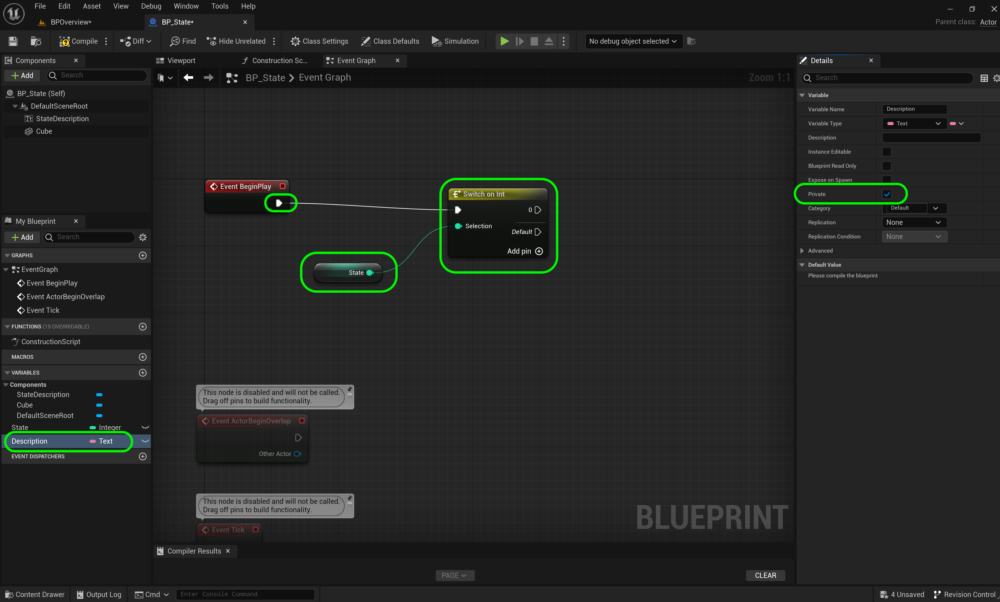

##### `Step 6.`\|`BPOVR`| :small_orange_diamond: :small_blue_diamond:

Drag a **Set Description** node and add `having some tea!` to the text box.  Connect the **Switch | 0** execution pin. 

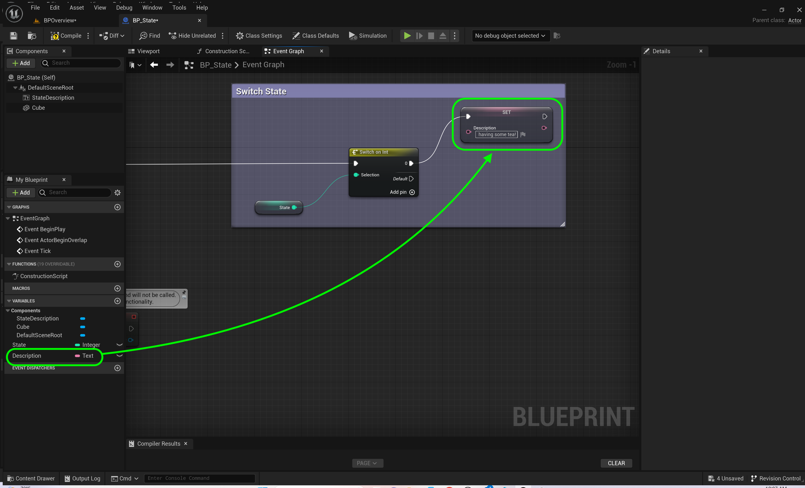

##### `Step 7.`\|`BPOVR`| :small_orange_diamond: :small_blue_diamond: :small_blue_diamond:

We do nto want to deal with the execution pins coming from the **Switch Statement**.  Otherwise to go to one location from say 10 switch conditions, we would have to wire all 10 execution pins to that node.  There is a cleaner way of handling a more complicated graph flow.  Lets add a **Sequence** node to the graph and put it between **Begin Play** and the **Switch on Int** nodes using the **Then 0** pin.

>The Sequence node allows for a single execution pulse to trigger a series of events in order. The node may have any number of outputs, all of which get called as soon as the Sequence node receives an input. They will always get called in order, but without any delay. To a typical user, the outputs will likely appear to have been triggered simultaneously.

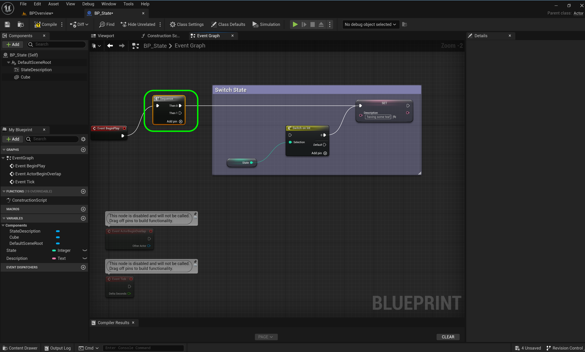

##### `Step 8.`\|`BPOVR`| :small_orange_diamond: :small_blue_diamond: :small_blue_diamond: :small_blue_diamond:

Drag a reference to the **State Description** component to the graph and pull off the pin and select **Set Text**.  Connect the data pins and the execution pin to the **Sequence | Then 1**.  S0 the first sequence pin will run all the conditions for the switch statements that are valid, then the `1` pin will run after that is complete.  This stops us from having to deal with the execution branch after each condition which would be messy.

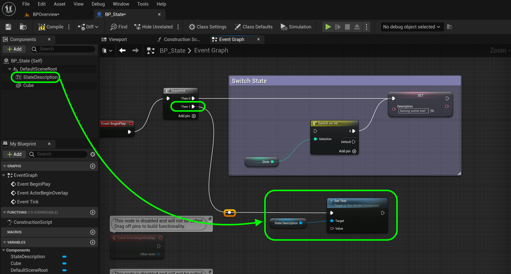

##### `Step 9.`\|`BPOVR`| :small_orange_diamond: :small_blue_diamond: :small_blue_diamond: :small_blue_diamond: :small_blue_diamond:

##### `Step 10.`\|`BPOVR`| :large_blue_diamond:

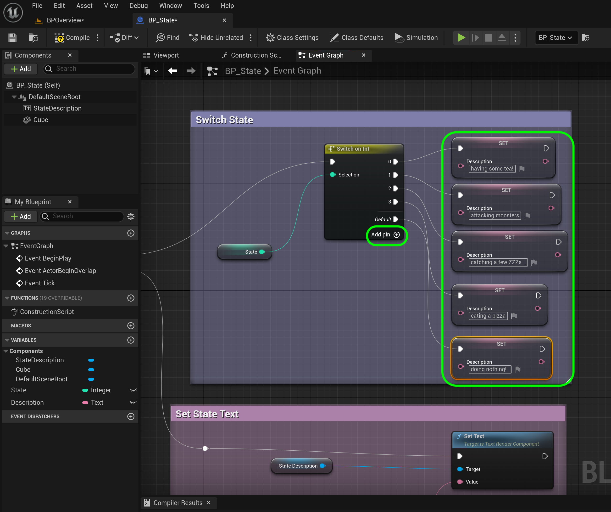

##### `Step 11.`\|`BPOVR`| :large_blue_diamond: :small_blue_diamond: 

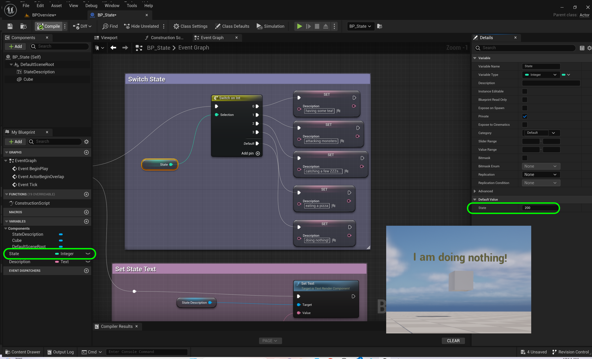

##### `Step 12.`\|`BPOVR`| :large_blue_diamond: :small_blue_diamond: :small_blue_diamond: 

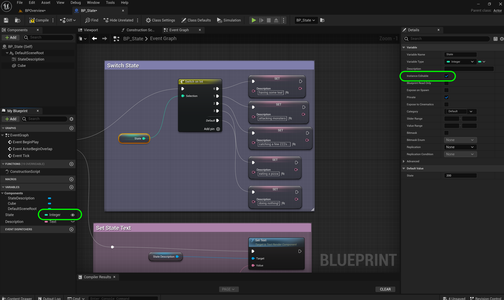

##### `Step 13.`\|`BPOVR`| :large_blue_diamond: :small_blue_diamond: :small_blue_diamond:  :small_blue_diamond: 

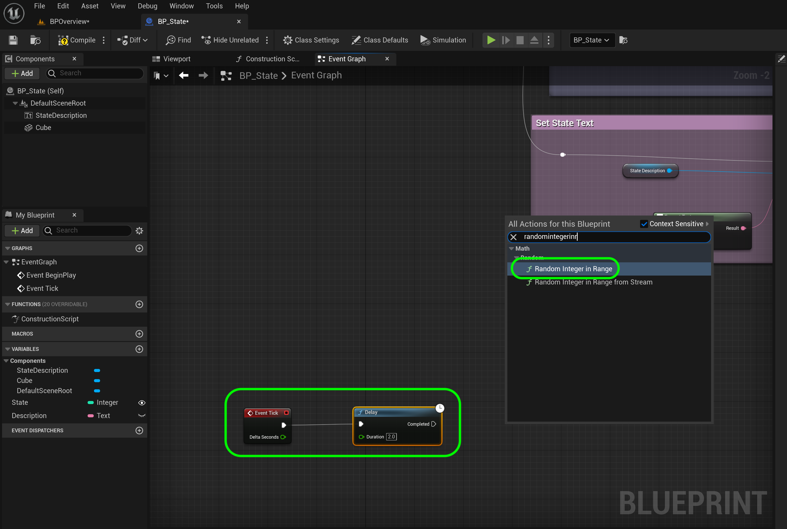

##### `Step 14.`\|`BPOVR`| :large_blue_diamond: :small_blue_diamond: :small_blue_diamond: :small_blue_diamond:  :small_blue_diamond: 

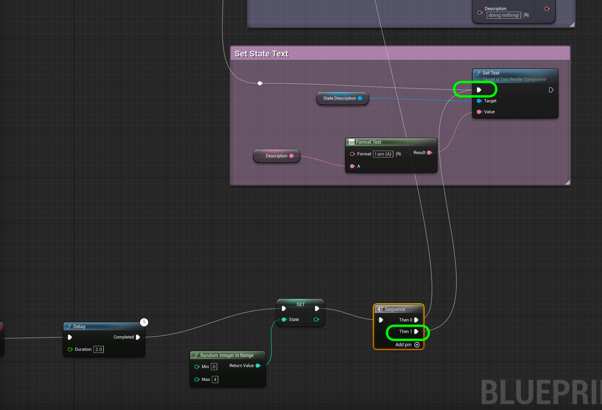

##### `Step 15.`\|`BPOVR`| :large_blue_diamond: :small_orange_diamond: 

Press the <kbd>Play</kbd> button.

https://github.com/maubanel/UE5-BP-Overview/assets/5504953/d96c3b09-d3ea-415b-866c-8bf431b0d2e6

<!--  -->

| [previous](../operators-ii/README.md#user-content-blueprint-operators-ii)| [home](../README.md#user-content-ue5-bp-overview) | [next](../iteration-ii/README.md#user-content-blueprint-iteration-ii)|
|---|---|---|
