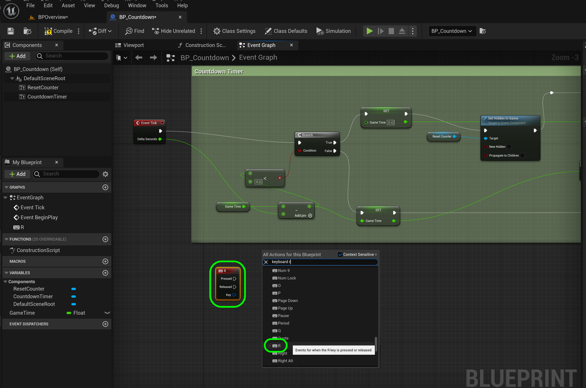
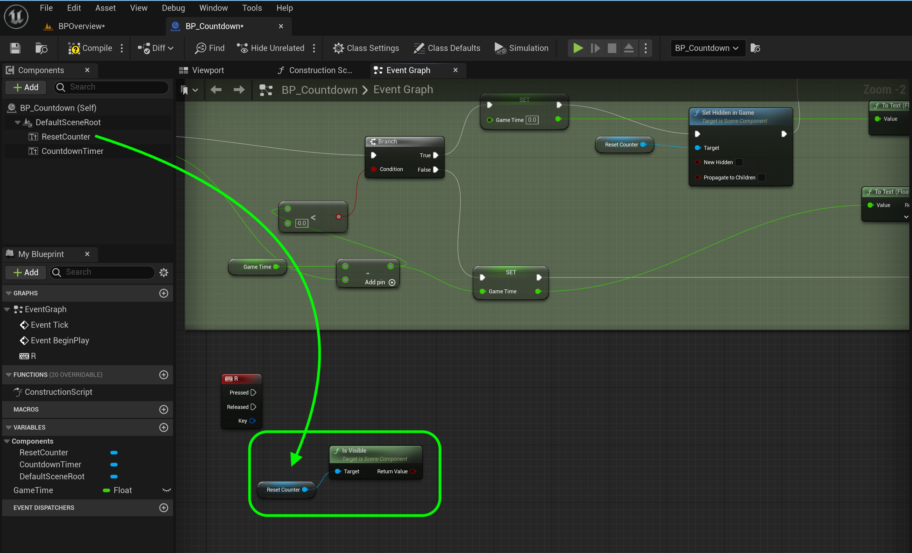
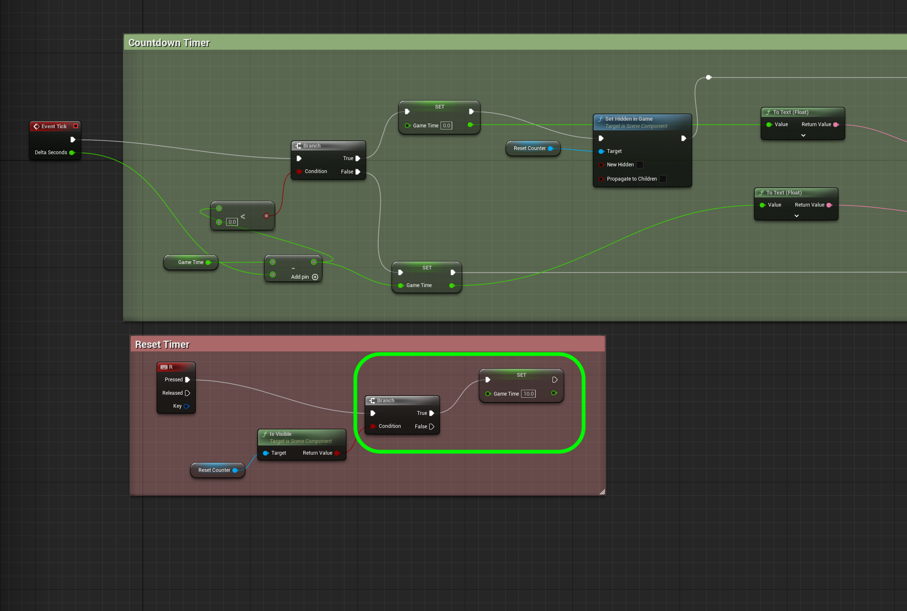
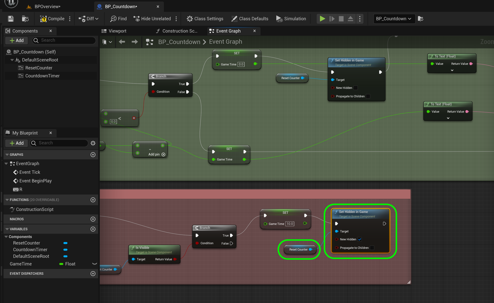

### Blueprint Operators II

[previous](../operators/README.md#user-content-blueprint-operators) • [home](../README.md#user-content-ue5-bp-overview) • [next](../)

Now that we have the countdown working, lets add the ability to reset it back to `10` when you press the <kbd>R</kbd> key.

 

---

##### `Step 1.`\|`BPOVR`|:small_blue_diamond:

Open up **BP_Countdown** and press the **+ Add** button to add another **TextRender** component.  Rename it to `Reset Counter`. Make it a different **Text Render Color** and **World Size** of `26`.  Change the **Horizontal Alignment** and **Vertical Alignment** to `Center` and `Text Center`.  Change the **Text** to `Press R to Restart Countdown`.

##### `Step 2.`\|`BPOVR`|:small_blue_diamond: :small_blue_diamond: 

Press the <kbd>Play</kbd> button and you will see that the message is visible the entire time. We want it to start without this message.

##### `Step 3.`\|`BPOVR`|:small_blue_diamond: :small_blue_diamond: :small_blue_diamond:

Drag a **ResetCounter** reference to the graph.  Also right click on the empty graph and add a **Event Begin Play** node. Drag off of the **ResetCounter** pin and select **Set Hidden in Game** node.

##### `Step 4.`\|`BPOVR`|:small_blue_diamond: :small_blue_diamond: :small_blue_diamond: :small_blue_diamond:

Connect the execution pin from **Begin Play** to **Set Hidden in Game** then make sure **New Hidden** is set to `true`.  This ensures the object does not render in game.

##### `Step 5.`\|`BPOVR`| :small_orange_diamond:

Now that we turned it off, we want to turn it on when **Game Time** is les than `0`.  So intercept the execution pin coming out of **Set GameTime** to `0` and add a reference to **ResetCounter** and and pull off the pin to add another **Set Hidden in Game** node, but this time set the **New Hidden** to `false` showing the text.

##### `Step 6.`\|`BPOVR`| :small_orange_diamond: :small_blue_diamond:

Press the <kbd>Play</kbd> button and when the timer gets to `0` the message appears.

https://github.com/maubanel/UE5-BP-Overview/assets/5504953/64cacc97-f10d-46a7-8995-2a20efed8daf

##### `Step 7.`\|`BPOVR`| :small_orange_diamond: :small_blue_diamond: :small_blue_diamond:

##### `Step 8.`\|`BPOVR`| :small_orange_diamond: :small_blue_diamond: :small_blue_diamond: :small_blue_diamond:

##### `Step 9.`\|`BPOVR`| :small_orange_diamond: :small_blue_diamond: :small_blue_diamond: :small_blue_diamond: :small_blue_diamond:

##### `Step 10.`\|`BPOVR`| :large_blue_diamond:

Press the <kbd>Play</kbd> button and when you cannot reset the timer until it gets to `0`.  That is working.  But once you do reset the time, the reset timer text is still showing.

https://github.com/maubanel/UE5-BP-Overview/assets/5504953/b50ff055-f77e-4229-8e4d-d543cd2df8cd

##### `Step 11.`\|`BPOVR`| :large_blue_diamond: :small_blue_diamond: 

##### `Step 12.`\|`BPOVR`| :large_blue_diamond: :small_blue_diamond: :small_blue_diamond: 

Press the <kbd>Play</kbd> button and 

<!--  -->

| [previous](../operators/README.md#user-content-blueprint-operators)| [home](../README.md#user-content-ue5-bp-overview) | [next](../)|
|---|---|---|
