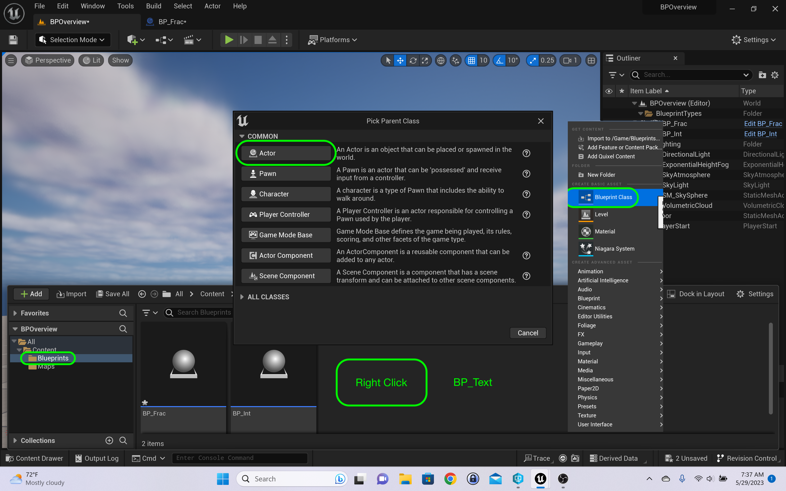
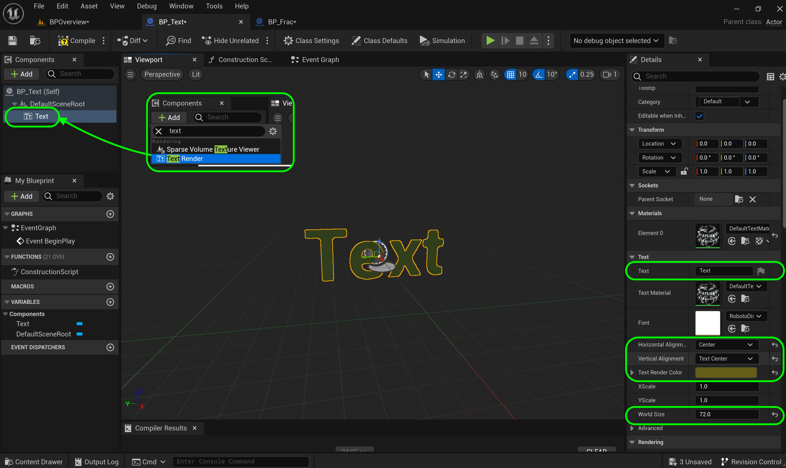
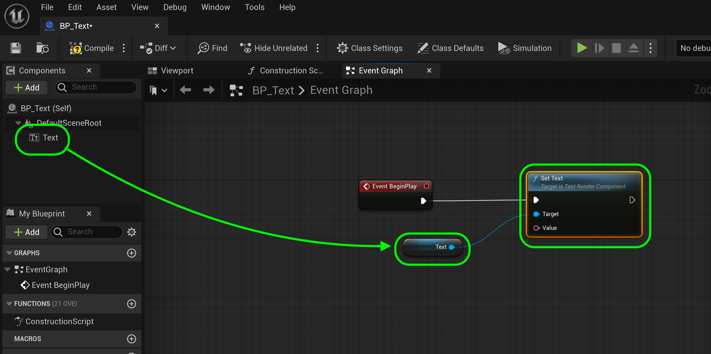

### Names Strings Text

[previous](../fractions/README.md#user-content-fractional-numbers) • [home](../README.md#user-content-ue5-bp-overview) • [next](../)

There are three types of text formats in **Unreal**.  It doesn't use the same **String** class as used in **C++ Standard Template Library**.  Usually for games more efficient libraries are written that sacrifice robustness for performance.

The three data types are **Names**, **Strings** and **Text**.

If you do not know about text types, it might be good to read the history of how we got here in [Unicode and Character Sets](https://www.joelonsoftware.com/2003/10/08/the-absolute-minimum-every-software-developer-absolutely-positively-must-know-about-unicode-and-character-sets-no-excuses/).

They are **FText**, **FName** and **FString**.  [FName](https://docs.unrealengine.com/en-us/Programming/UnrealArchitecture/StringHandling/FName) are used for names (non-customer facing) of items in the **Content Browser**. This format has 8 bytes per character. It is the smallest format and is used to refer to objects in the editor (like the name of a Material variable).  It is also the smallest format and is often used in multiplayer to reduce the size of packets sent, if text needs to be sent between client and server or vice versa.

[FString](https://docs.unrealengine.com/en-us/Programming/UnrealArchitecture/StringHandling/FString) is a 
16 byte format that allows dynamic modification as well as replace, search concatonate etc... It is less performant but is used most often for manipulation.

[FText](https://docs.unrealengine.com/en-us/Programming/UnrealArchitecture/StringHandling/FText) a 40 byte format is for all customer facing text that requires localization (Like the HUD, or buttons in the front end).  Please note that in **Blueprints** we do not have the built-in **char** ????CEHCK THIS MARC???? type. You can use it in C++ only but will not show up in **Blueprint**.

 

---

##### `Step 1.`\|`BPOVR`|:small_blue_diamond:

Select the **Blueprints** folder and right click in the directory and a **Blueprint Class** and select the **Actor** class.  Call this new **Blueprint** `BP_Text`.

##### `Step 2.`\|`BPOVR`|:small_blue_diamond: :small_blue_diamond: 

Open up **BP_Text**. Add a **TextRender** component and call it `Text`. Change the **Text** to `Text`.  Adjust the **Horizontal Alignment** and **Vertical Alignment** to `Center` and `Text Center`.  Copy and paste the color from **BP_Frac**.  Change the **World Size** to `72`.

##### `Step 3.`\|`BPOVR`|:small_blue_diamond: :small_blue_diamond: :small_blue_diamond:

Drag the **Text** component onto the graph.  Then drag off the pin and select a **Set Text** node.  Connect the execution pin to **Begin Play**.

##### `Step 4.`\|`BPOVR`|:small_blue_diamond: :small_blue_diamond: :small_blue_diamond: :small_blue_diamond:

Now lets demonstrate the three text types (they will all look identical) by adding a **Make Literal Text**, **Make Literal String** and **Make Literal Name** node.

##### `Step 5.`\|`BPOVR`| :small_orange_diamond:

##### `Step 6.`\|`BPOVR`| :small_orange_diamond: :small_blue_diamond:

##### `Step 7.`\|`BPOVR`| :small_orange_diamond: :small_blue_diamond: :small_blue_diamond:

##### `Step 8.`\|`BPOVR`| :small_orange_diamond: :small_blue_diamond: :small_blue_diamond: :small_blue_diamond:

##### `Step 9.`\|`BPOVR`| :small_orange_diamond: :small_blue_diamond: :small_blue_diamond: :small_blue_diamond: :small_blue_diamond:

##### `Step 10.`\|`BPOVR`| :large_blue_diamond:

##### `Step 11.`\|`BPOVR`| :large_blue_diamond: :small_blue_diamond: 

##### `Step 12.`\|`BPOVR`| :large_blue_diamond: :small_blue_diamond: :small_blue_diamond: 

##### `Step 13.`\|`BPOVR`| :large_blue_diamond: :small_blue_diamond: :small_blue_diamond:  :small_blue_diamond: 

##### `Step 14.`\|`BPOVR`| :large_blue_diamond: :small_blue_diamond: :small_blue_diamond: :small_blue_diamond:  :small_blue_diamond: 

##### `Step 15.`\|`BPOVR`| :large_blue_diamond: :small_orange_diamond: 

##### `Step 16.`\|`BPOVR`| :large_blue_diamond: :small_orange_diamond:   :small_blue_diamond: 

##### `Step 17.`\|`BPOVR`| :large_blue_diamond: :small_orange_diamond: :small_blue_diamond: :small_blue_diamond:

##### `Step 18.`\|`BPOVR`| :large_blue_diamond: :small_orange_diamond: :small_blue_diamond: :small_blue_diamond: :small_blue_diamond:

##### `Step 19.`\|`BPOVR`| :large_blue_diamond: :small_orange_diamond: :small_blue_diamond: :small_blue_diamond: :small_blue_diamond: :small_blue_diamond:

##### `Step 20.`\|`BPOVR`| :large_blue_diamond: :large_blue_diamond:

##### `Step 21.`\|`BPOVR`| :large_blue_diamond: :large_blue_diamond: :small_blue_diamond:

<!--  -->

| [previous](../fractions/README.md#user-content-fractional-numbers)| [home](../README.md#user-content-ue5-bp-overview) | [next](../)|
|---|---|---|
